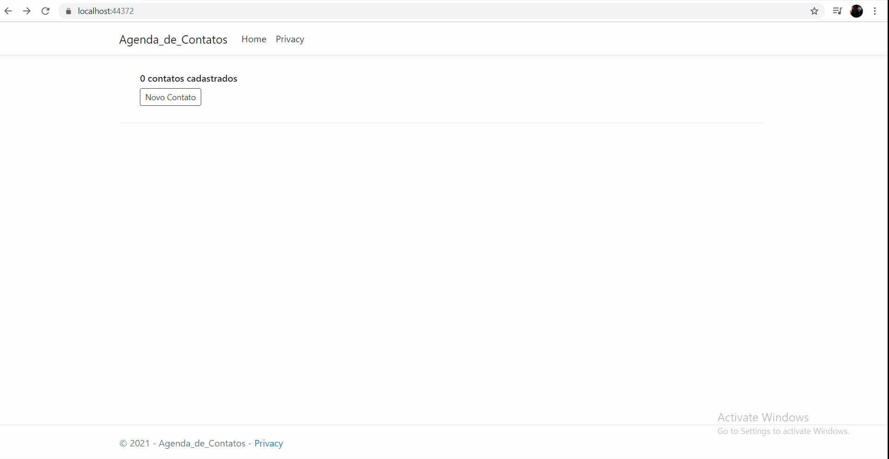

<h1>Agenda De Contatos</h1>

<h2>Descrição</h2>

Projeto desenvolvido com instrutor <a href="https://www.youtube.com/channel/UCCwJyJxcZBILjI4gso6E1bQ">Thiago Paiva</a>, utilizando ASP.NET CORE MVC para a criaçãod e uma agenda telefonica simples. 
O projeto tem intuido de colocar em pratica C# e orientação à objetos, conexão com banco de dados(operações CRUD),utilizando ASPNET CORE e padrão MVC.

<h3>Tecnologias Utilizadas</h3>
<ul>
<li>AspNetCore</li>
<li>EntityFrameworkCore</li>
<li>Jquery</li>
<li>Bootstrap</li>
<li>SqlServer</li>
<li>Razor</li>
</ul>

<h3>Apresentação do Projeto<h3>
 